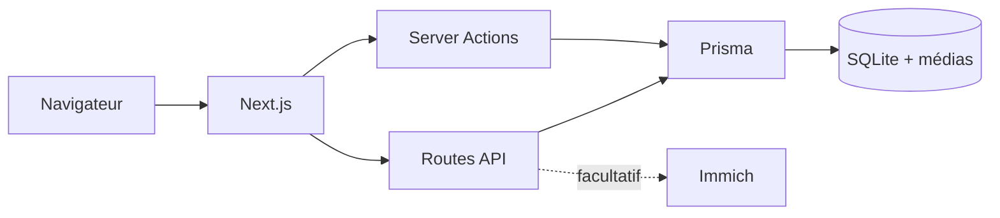

# Liens

<p align="center">
  <strong>Liens</strong><br>
  Carnet relationnel privé, auto-hébergeable et pensé pour garder le contrôle de ses données.
</p>

<p align="center">
  
  
  
  
  
  
  
</p>

<p align="center">
  <a href="#fonctionnalités">Fonctionnalités</a>
  ·
  <a href="#démarrage-rapide-avec-docker">Installation</a>
  ·
  <a href="#configuration">Configuration</a>
  ·
  <a href="#sécurité-et-confidentialité">Sécurité</a>
</p>

Liens est un carnet relationnel privé et auto-hébergeable...

Liens est un carnet relationnel privé et auto-hébergeable. Il aide à entretenir ses relations personnelles sans envoyer les données vers un service tiers : personnes, échanges, rappels, cercles, arbre familial, dates importantes et notes restent sur votre instance.

> Le projet est en développement actif. Sauvegardez régulièrement vos données avant chaque mise à jour.

## Fonctionnalités

- carnet de personnes avec coordonnées, relations, statuts et champs personnalisés ;
- historique des échanges, rappels et suggestions de reconnexion ;
- cercles de suivi et objectifs hebdomadaires ;
- arbre familial, liens entre personnes et animaux ;
- journal privé, sujets à reprendre, idées cadeaux et finances ;
- import vCard/CSV et export des données ;
- galerie facultative reliée à Immich ;
- comptes séparés avec isolation des données ;
- interface responsive, thème clair et sombre.

## Architecture



Liens vise une instance personnelle ou familiale sur un seul serveur. SQLite simplifie l’exploitation et la sauvegarde, mais n’est pas adapté à plusieurs réplicas applicatifs écrivant simultanément.

## Démarrage rapide avec Docker

Prérequis : Docker Engine et Docker Compose v2.

```bash
git clone <URL_DU_DEPOT>
cd family
cp .env.example .env
docker compose up -d --build
```

Ouvrez ensuite `http://localhost:3000` et créez le premier compte. Fermez les inscriptions une fois les comptes nécessaires créés :

```dotenv
REGISTRATION_OPEN="false"
```

Puis appliquez la configuration :

```bash
docker compose up -d
```

## Configuration

Les variables peuvent être placées dans `.env`.

| Variable | Défaut | Description |
| --- | --- | --- |
| `APP_HOST` | `0.0.0.0` | Interface réseau exposée par Docker |
| `APP_PORT` | `3000` | Port exposé par Docker |
| `DATABASE_URL` | `file:./data/family.db` | URL SQLite relative au dossier `prisma` |
| `REGISTRATION_OPEN` | `true` | Autorise la création de nouveaux comptes |
| `SESSION_COOKIE_SECURE` | `auto` | Force le cookie de session HTTPS avec `true` |
| `SEED_DEMO_DATA` | `false` | Ajoute des données de démonstration si la base est vide |
| `NOMINIS_ENABLED` | `false` | Active les données externes de fêtes des prénoms |
| `IMMICH_URL` | vide | URL de l’API Immich, par exemple `http://immich-server:2283/api` |
| `IMMICH_API_KEY` | vide | Clé API Immich |
| `LIENS_IMAGE` | `liens:latest` | Image Docker à lancer |

En production, placez Liens derrière un reverse proxy HTTPS, utilisez `SESSION_COOKIE_SECURE=true`, fermez les inscriptions et limitez l’accès réseau selon votre besoin.

## Exploitation

### Mise à jour

```bash
git pull
docker compose up -d --build
```

Les migrations Prisma sont appliquées automatiquement au démarrage. Une base créée par une ancienne version utilisant `db push` est reconnue et rattachée à la migration initiale sans recréer ses tables.

### Sauvegarde

La sauvegarde contient la base SQLite et tout le dossier `prisma/data`, notamment les médias importés.

```bash
./scripts/backup.sh
./scripts/backup.sh sauvegardes/liens-$(date +%F).tar.gz
```

### Restauration

Arrêtez l’application, remplacez le contenu du volume par le dossier `data` de l’archive, puis redémarrez :

```bash
docker compose down
docker compose run --rm --no-deps -v "$PWD":/backup --entrypoint sh liens \
  -c 'find /app/prisma/data -mindepth 1 -maxdepth 1 -exec rm -rf {} + &&
      tar -xzf /backup/liens-data-backup.tar.gz -C /app/prisma'
docker compose up -d
```

### Santé et journaux

```bash
docker compose ps
docker compose logs -f --tail=100 liens
```

Le conteneur expose un contrôle de santé HTTP sur `/login`, abandonne ses privilèges avant de lancer l’application et limite la rotation des journaux Docker.

## Intégration Immich

Créez une clé API en lecture dans Immich, puis configurez :

```dotenv
IMMICH_URL="http://immich-server:2283/api"
IMMICH_API_KEY="votre-cle"
```

Les appels à Immich passent par le serveur Liens. La clé API n’est pas envoyée au navigateur.

## Développement

Prérequis : Node.js 22 et npm.

```bash
npm ci
cp .env.example .env
npm run db:migrate
npm run dev
```

Commandes principales :

| Commande | Usage |
| --- | --- |
| `npm run dev` | serveur de développement |
| `npm run db:migrate` | crée et applique une migration en développement |
| `npm run db:migrate:deploy` | applique les migrations existantes |
| `npm run db:seed` | ajoute les données minimales |
| `npm run lint` | analyse statique |
| `npm test` | tests unitaires et métier |
| `npm run test:e2e` | parcours critiques Playwright |
| `npm run build` | build de production |
| `npm run check` | lint, tests unitaires et build |

Pour le premier lancement des tests E2E :

```bash
npx playwright install chromium
npm run test:e2e
```

Les tests E2E utilisent leur propre base `prisma/data/e2e.db`, recréée à chaque exécution.

## Structure du dépôt

```text
src/app/             pages, routes API et Server Actions
src/components/      composants d’interface et formulaires
src/lib/             authentification, base et logique partagée
prisma/              schéma, migrations et seeds
e2e/                 parcours critiques Playwright
scripts/             scripts d’exploitation
```

## Sécurité et confidentialité

Liens contient des données personnelles sensibles. L’administrateur de l’instance est responsable de l’accès réseau, du chiffrement HTTPS, des sauvegardes et de leur conservation. Consultez [SECURITY.md](SECURITY.md) pour signaler une vulnérabilité.

## Contribution

Les règles de développement, de migration, de test et de commits sont décrites dans [CONTRIBUTING.md](CONTRIBUTING.md). Toute contribution fonctionnelle doit préserver l’isolation des données entre comptes et inclure les tests adaptés.

## Licence et dépendances

Aucune licence de redistribution n’est définie pour le moment pour le code propre à Liens. Le code reste soumis au droit d’auteur de ses contributeurs.

Liens utilise plusieurs projets open source tiers, chacun conservant sa propre licence :

| Projet | Usage | Licence |
| --- | --- | --- |
| Next.js | framework applicatif React | MIT |
| React | bibliothèque d’interface | MIT |
| Prisma | ORM et migrations de base de données | Apache-2.0 |
| SQLite | base de données embarquée | domaine public |
| shadcn/ui | base de composants d’interface | MIT |
| Lucide | icônes de l’interface | ISC / MIT pour les icônes dérivées de Feather |
| Tailwind CSS | styles utilitaires | MIT |
| Playwright | tests end-to-end | Apache-2.0 |

Les licences des dépendances tierces restent applicables à leurs fichiers, paquets et composants respectifs. Cette section ne modifie pas la licence du code propre à Liens.